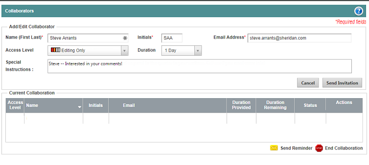

Procedures
==========

Here are some rules of thumb for writing effective procedures.

* Each action is a numbered step. Results do not take a number as they are not a step.
* If there is only one step, use a bullet, and not the number 1.
* Use active voice. It is easier to understand.
* Use second person. You're talking to the user, so second person is best. You can even use the word *You* in your instructions (like I just did).
* Present tense, please. Most of the time (all of the time?) users read the instructions when they're in the middle of trying to do something or solve a problem.
* No more than 8 steps. If you require more, break the procedure up into a grouped set of procedures.
* Include images and videos if they help the user.
* Use sub-steps sparingly, and use bullets, not a, b, c, etc.

Also, don't use *Input* to show typing, or another way of entering
information. Use *Type* instead.

Here is a procedure from the ArticleExpress Help
------------------------------------------------

#### To invite a collaborator:

1.  Click the **Collaboration** tab. ArticleExpress displays the
    **Collaborators** form.
    
2.  Fill out the **Add/Edit Collaborator** section. ArticleExpress
    requires the name, initials, and email address.
3.  Change the **Access Level** and **Duration**, if desired.
4.  Add any message or special instructions to include in the email.
5.  Click **Send Invitation**. ArticleExpress sends the invitation to
    the designated collaborator.
